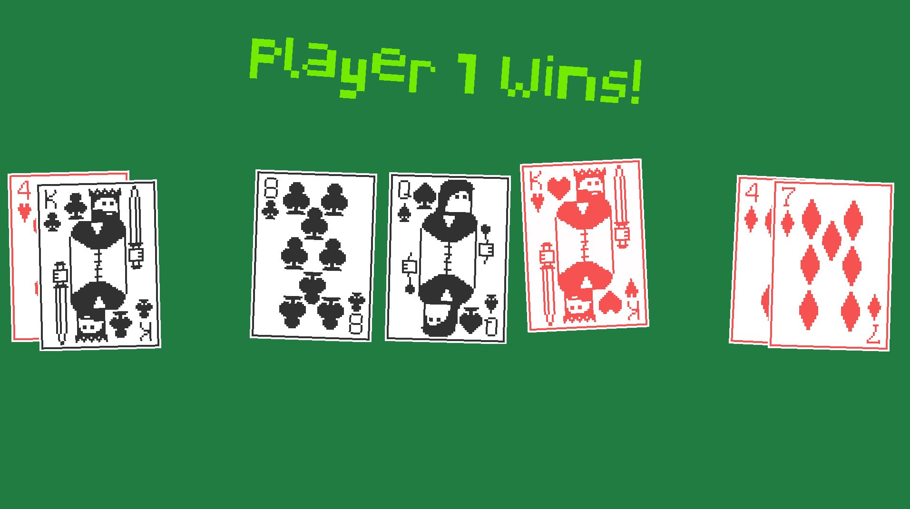

# PythonCodes
Codes in Python


<h1 align="center"> Poker Game with Python </h1>


<p align="center">

</p>


# pokerhands
Simple poker game that determines the best hand




# Description

English

Project of a simple poker game, without taking into account a betting interface.
A graphical interface was used for Pygame.
The goal is to explore class relationships and improve thinking focused on object-oriented programming.


## Instructions

Pygame and Python3 are required, as well as card images and font in graphics/

From cmd/PowerShell:

```sh
python main.py
```


Português-Br

Projeto de um jogo de poquer simples, sem levar em conta uma interface para as apostas.
Foi utilizado uma interface gráfica para com Pygame.
O objetivo é explorar os relacionamentos de classes e aprimorar o pensamento voltado para programação orientado a objeto. 


## Instruções

Pygame e Python3 são necessários, bem como imagens de cartão e fonte em gráficos/


No cmd/PowerShell:

```sh
python main.py
```

# UML Diagram


## Resources:
Card audio: https://pixabay.com/sound-effects/search/card%20dealing/  
Card images: https://zxyonitch.itch.io/pixel-playing-cards-52-cards-card-back  
Hand Ranking algorithm: https://codereview.stackexchange.com/questions/128702/poker-hands-in-python  
Pixelated Display font: https://www.dafont.com/pixelated-display.font  


# Author

| [<br><sub>Carlos Hayden</sub>](https://github.com/JunhaumHayden) |
| :---: |


