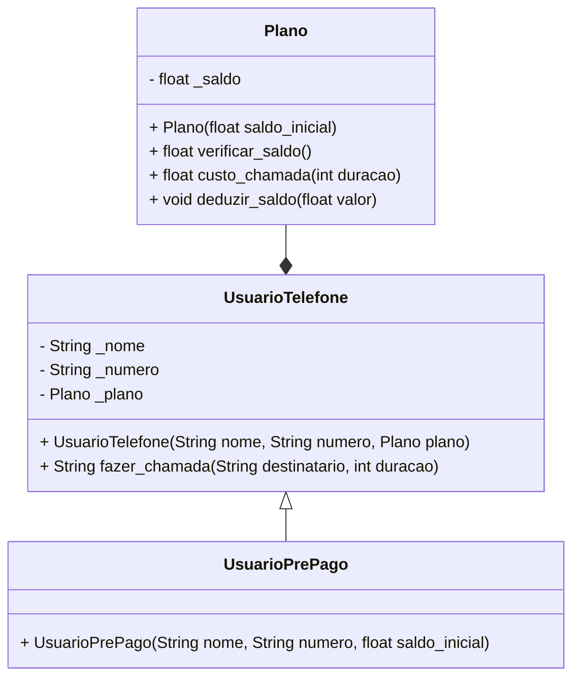

```mermaid
classDiagram


    class Plano {
        - float _saldo
        + Plano(float saldo_inicial)
        + float verificar_saldo()
        + float custo_chamada(int duracao)
        + void deduzir_saldo(float valor)
    }

    class UsuarioTelefone {
        - String _nome
        - String _numero
        - Plano _plano
        + UsuarioTelefone(String nome, String numero, Plano plano)
        + String fazer_chamada(String destinatario, int duracao)
    }

    class UsuarioPrePago {
        + UsuarioPrePago(String nome, String numero, float saldo_inicial)
    }

    Plano --* UsuarioTelefone
    UsuarioTelefone <|-- UsuarioPrePago
```